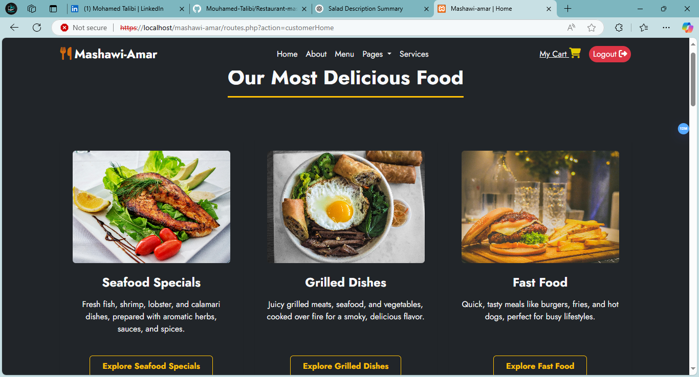
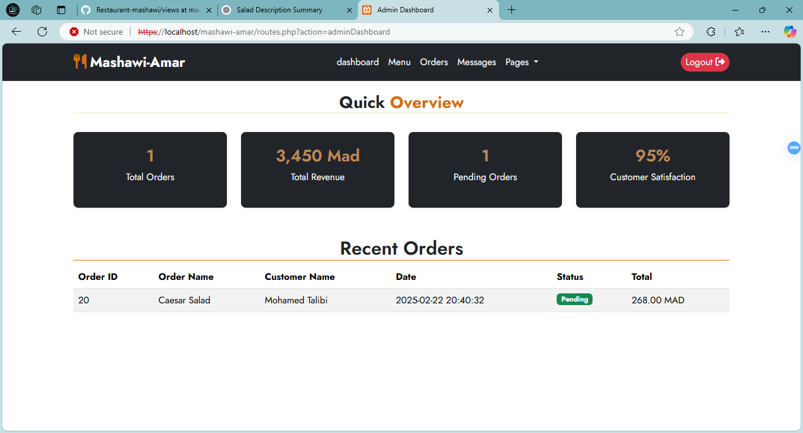

# 🍽️ Restaurant Management System

## 🚀 Overview
I am excited to share my latest project: a **Restaurant Management System**! This project allowed me to **practice and apply** all the knowledge I have gained in web development. It provides a seamless experience for customers to **create accounts, explore the menu, and order food** while offering powerful admin management features.

## 🎯 Features
### 👤 Customer Features
- **Create an Account**: Sign up.
- **Login & Authentication**: Secure login system.
- **Explore the Menu**: Browse a list of delicious food items.
- **Search for Food**: Quickly find specific dishes.
- **Order Food**: Add food items to the cart and place an order.
- **Edit Orders**: Modify an order before it is processed.
- **Cancel Orders**: Cancel an order if necessary.
- **Form Validation**: Ensures all required fields are filled to improve user experience.

### 🔑 Admin Features
- **Manage Categories**: Add, View, update, and delete Categories.
- **Products Management**: Add, View, Update and delete Products.
- **Menu Management**: Add, edit, or remove food items.
- **Secure Authentication**: Only authorized users can access the admin panel.

## 🛠️ Technologies Used
### 🌐 Frontend
- **HTML5**
- **CSS3**
- **Bootstrap 5** (Responsive UI)

### 🖥️ Backend
- **PHP** (with MVC design pattern)
- **MySQL** (Relational Database)

## 📂 Installation
### 1️⃣ Clone the Repository
```sh
 git clone https://github.com/Mouhamed-Talibi/Restaurant-mashawi.git
 cd Restaurant-mashawi
```
### 2️⃣ Setup Database
- Import the **database.sql** file into MySQL.
- Update database credentials in `models/Database.php`.

### 3️⃣ Start the Server
If using XAMPP, place the project in the `htdocs` folder and start **Apache** and **MySQL**.
```sh
http://localhost/Restaurant-mashawi/
```

## 📸 Screenshots
🔹 **Customer Dashboard**  


🔹 **Admin Panel**  


## 🤝 Contributing
Feel free to **fork** this repository and submit a **pull request** if you'd like to improve the project! Any feedback is welcome. 😊

## 📧 Contact
- **LinkedIn**: [My LinkedIn Profile]([https://linkedin.com/in/yourprofile](https://www.linkedin.com/in/mohamed-talibi-639902333/))
- **GitHub**: [My GitHub Profile](https://github.com/Mouhamed-Talibi)
- **Instagram**: [My Instagram Profile](https://www.instagram.com/easy.code_/)

---
📌 *If you like this project, don't forget to ⭐ it!*
